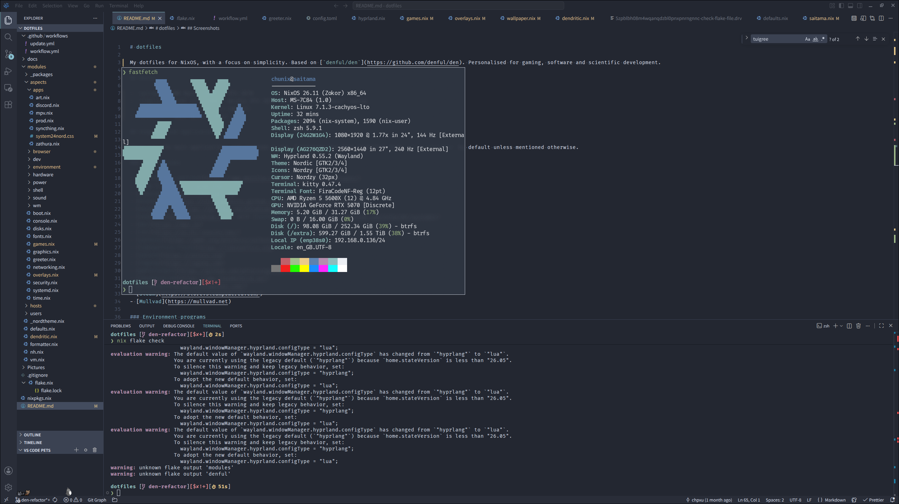
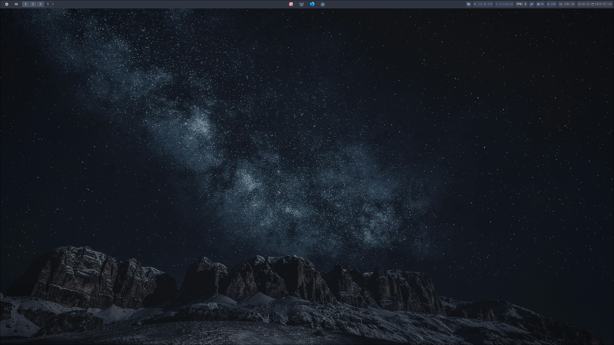

# dotfiles

My dotfiles for NixOS, with a focus on simplicity. Based on [`denful/den`](https://github.com/denful/den). Personalised for gaming, software and scientific development.

## Hosts

- `saitama`: AMD Ryzen 5600X + RTX 5070
- `jingliu`: Intel i7-12700H + Nvidia RTX 3070 Ti "Advanced Optimus" laptop
- `yoga`: Lenovo Yoga C940 (i7-1065G7)
- `walworth`: work device (WSL)

## Programs and Applications

These are the main applications and programs I use. Everything has been installed from `nixos-unstable` by default unless mentioned otherwise.

### Applications

- [firefox-dev-edition](https://www.mozilla.org/en-GB/firefox/developer/)
- [gimp 3.x](https://gimp.org)
- [inkscape](https://inkscape.org)
- [nix4nvchad](https://nix-community.github.io/nix4nvchad/introduction.html)
- [vscodium-fhs](https://github.com/VSCodium/vscodium)
- [vesktop](https://vesktop.dev/) with [system24 nord theme](https://github.com/refact0r/system24)
- [mpv](https://mpv.io)
- [imv](https://sr.ht/~exec64/imv/)
- [zathura](https://pwmt.org/projects/zathura/)
- [libreoffice-fresh](https://libreoffice.org)
- [zotero](https://zotero.org)
- [logseq](https://logseq.com)
- [pdfarranger](https://github.com/pdfarranger/pdfarranger)
- [thunderbird](https://www.thunderbird.net)
- [bitwarden](https://bitwarden.com/)
- [steam](https://store.steampowered.com/)
- [Mullvad](https://mullvad.net)

### Environment programs

Applications or programs which affect my workspace

- [Hyprland](https://hyprland.org)
  - Plugins: [hyprsplit](https://github.com/shezdy/hyprsplit).
- [awww](https://codeberg.org/LGFae/awww)
- [waybar](https://github.com/Alexays/Waybar) (built with `-Dexperimental=true`)
- [yazi](https://yazi-rs.github.io/)
- [swayidle](https://github.com/swaywm/swayidle)
- [swaylock-effects](https://github.com/jirutka/swaylock-effects) (jirutka fork)
- [mako](https://github.com/emersion/mako)
- [cliphist](https://github.com/sentriz/cliphist) + [wl-clipboard](https://github.com/bugaevc/wl-clipboard)
- [rofi](https://github.com/lbonn/rofi#wayland-support)
- [kitty](https://sw.kovidgoyal.net/kitty/)
- [zsh](https://zsh.org) + [starship](https://starship.rs)
- [wvkbd](https://github.com/jjsullivan5196/wvkbd) (custom derivation to add theming. See my [repo](https://github.com/chpxu/wvkbd))
- [direnv](https://direnv.net)
- [dragon-drop](https://github.com/mwh/dragon)
- [tuigreet](https://github.com/NotAShelf/tuigreet)

### Other things I use

- [devflake](https://github.com/chpxu/development-flake)
- [materials-flake](https://github.com/chpxu/materials-flake)
- [fufexan/nix-gaming](https://github.com/fufexan/nix-gaming)
- [CachyOS Kernels](https://github.com/xddxdd/nix-cachyos-kernel)

## Screenshots

